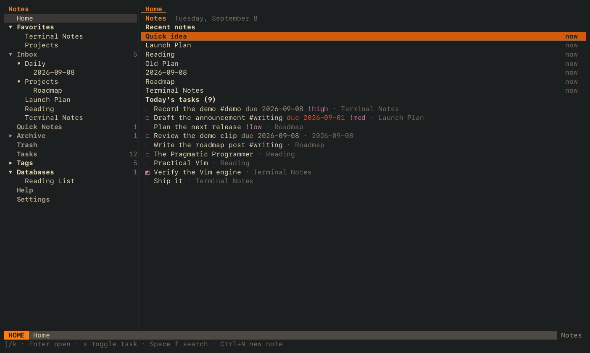

# zn

ZenNotes in the terminal: the `zn` command line and a full terminal app,
in one static Go binary.

<p align="center">
  <a href="docs/media/zn-tui-demo.mp4"></a>
</p>

Notes stay plain Markdown files in a folder you own. `zn` reads the same
vault, `config.toml` and `vault.json` as the ZenNotes desktop app, so both
can work on one vault, and a self-hosted ZenNotes server works as a remote
vault too.

## What you get

- **The command line.** Every command of the desktop app's bundled `zn`
  (notes, search, folders, tags, tasks, comments, databases, capture,
  `open`, the MCP server), with the same names, flags, JSON shapes and task
  ids, so scripts written for one work with the other.
- **`zn tui`, the app.** Sidebar, tabs, splits, a reading view, Tasks as a
  list, Kanban board or calendar, Tags, databases with table and board
  views, templates, daily notes, a command palette, and a Vim engine at the
  core of everything.
- **`zn mcp`.** The same tools the desktop's MCP server offers, for Claude
  Code, Codex and any MCP client.

## Install

```bash
go install github.com/ZenNotes/tui/cmd/zn@latest
```

Or build from a checkout with `go build -o zn ./cmd/zn` (Go 1.24 or newer).
The binary has no runtime dependencies. Prebuilt binaries and a Homebrew
formula are not published yet.

## Quick start

Three commands cover every way to get a vault in front of `zn`. Each one
remembers its result and makes it the default, so the next `zn` or `zn tui`
needs no flags.

```bash
zn init ~/Notes                      # create a vault (settings file + a welcome note)
zn vault add ~/Documents/notes       # use a folder of Markdown you already have
zn connect https://notes.example.com # a self-hosted ZenNotes server; asks for the token once
zn tui                               # open it
```

`zn setup` asks those questions interactively, and `zn tui` runs the same
wizard when nothing is configured yet. Later:

| Command | What it does |
| --- | --- |
| `zn vault list` | Every saved vault and server, the default starred |
| `zn use <name>` | Make a saved vault or server the default (`zn use app` follows the desktop app's vault again) |
| `zn disconnect <name>` | Forget a server and its token |
| `zn vault mode root\|inbox` | Move a vault between the flat layout and the classic `inbox/` layout |

The list lives in `~/.config/zennotes/workspaces.toml`; server tokens go to
`credentials.toml` next to it, readable only by you. Scripts and CI can skip
the store with `--server <url>` and `ZENNOTES_REMOTE_TOKEN`.

## Commands

Every command takes `--json`; `zn --help` lists the flags of each one.

| Area | Commands |
| --- | --- |
| Notes | `list` `read` `create` `write` `append` `prepend` `rename` `move` `archive` `unarchive` `trash` `restore` `duplicate` `delete` |
| Search | `search <query>` `search-title <q>` `backlinks <path>` |
| Folders | `folder list\|create\|rename\|delete` |
| Tags | `tag list\|find` |
| Tasks | `task list\|toggle` |
| Comments | `comment list\|add\|reply\|resolve`, threads on a note shared with the app and its MCP tools |
| Databases | `base list\|create\|rows\|get\|add\|set\|convert`, for `.base` folders and loose `.csv` files |
| Vaults | `setup` `init` `connect` `disconnect` `use` `vault info\|list\|mode\|add\|remove` |
| Other | `capture "..."` (quick note from an argument or stdin), `open <path>` (hand a note to the desktop app), `config` (open `config.toml` in `$EDITOR`), `read --pretty` (render a note in the terminal) |
| Servers | `mcp` (MCP stdio server), `tui [note]` (the terminal app) |

## The terminal app

```bash
zn tui                          # the default vault
zn tui "Project Plan.md"        # open a note straight away
zn tui --vault ~/notes          # a directory
zn tui --server home            # a saved server
```

Every pane is a framed box with its tab strip above it: the active tab is a
filled block, `+` opens a new note, and the frame's top edge names what the
pane shows (`editor`, `preview`, `database`, `tasks`). `:zen` drops all the
chrome.

### Moving around

`Space` is the leader. Press it and wait a moment for the which-key panel.

| Keys | What |
| --- | --- |
| `Ctrl+P` | Search notes (Enter creates the note when nothing matches) |
| `Ctrl+N` | New note in the current folder |
| `Ctrl+S` | Save now (notes autosave a moment after you stop typing) |
| `Ctrl+B` | Toggle the sidebar |
| `Ctrl+W` then `v` `s` `h` `j` `k` `l` `q` `o` `=` | Split, move between and close panes |
| `Ctrl+O` `Ctrl+I` | Jump back and forward across notes |
| `gt` `gT` `]b` `[b` | Next and previous tab |
| `:` | Ex commands; `Space ;` or `Ctrl+G` opens the command palette |
| `?` | The keys of the current view; `:help` is the full manual |

The `Alt` chords (`Alt+1`…`Alt+9` for tabs, `Alt+E/S/P` for editor, split
and preview, `Alt+.` for zen) work where the terminal sends Option as Alt
(Ghostty: `macos-option-as-alt = true`). Everything they do has a leader or
`Ctrl+W` route as well.

### Leader map

| `Space` + | Opens |
| --- | --- |
| `o` `f` `s t` | Open buffers, search notes, search vault text |
| `e` `p` `c` | Toggle the sidebar, the outline panel, the calendar panel |
| `x` `k` | Tasks, the Kanban board |
| `d` `w` `m` | Today's daily note, this week's, this month's |
| `n` `q` `t` `i` | New note, quick capture, new note from a template, insert a template |
| `v` | Switch vault or server |
| `z p/s/e/v` `z w/n/z/t` | View: preview, split, editor, toggle; word wrap, line numbers, zen, theme |
| `l f/y/s/r/m/d/a/c/o/e` | Note: format, copy, favorite, rename, move, trash, archive, copy link, open in the desktop app, edit in `$EDITOR` |
| `h` `;` `?` | Hint mode, command palette, manual |

### Editing

The editor is a full Vim: counts, registers, marks, macros, dot-repeat,
undo and redo, text objects, visual, visual line and visual block, search,
`:s` `:g` `:sort` `:norm` with ranges, `gq`, and heading motions `]]` `[[`.
Markdown on top: `Ctrl+L` toggles the checkbox on the line, `gd` follows a
link, `gx` opens a URL, `gy` copies a link, `zc zo zM zR` fold headings,
Enter continues lists, Tab indents list items, `[[` opens the note picker
in insert mode, and fenced code is syntax-highlighted.

Vim mode follows `[vim] enabled` in `config.toml`. With it off, the editor
is a plain editor and lists answer only to arrows, Enter and Escape.

`Space l e` opens the note in `$VISUAL` or `$EDITOR` at the cursor line and
reloads it afterwards. `Ctrl+Z` suspends to the shell.

### Views

- **Tasks** has three layouts: list, Kanban board and calendar. Open one
  with `:tasks list|kanban|calendar`, `Space x`, `Space k`, or the rows
  under Tasks in the sidebar; `v` cycles them. `x` toggles, Enter opens the
  note at the line, `p d w c /` set priority, due date, waiting, cancelled
  and in progress, `f` filters (`#tag`, `due:today`, `priority:high`,
  `status:x`, `is:open`, `-term`), `m` opens the menu. On the board `H`/`L`
  move a card and `g` regroups by status, priority, due date or any
  `@field`. On the calendar Enter lists a day's tasks and `o` opens its
  daily note.
- **Tags**: `Tab` multi-selects, `a` toggles any/all, `r`/`x` rename or
  remove a tag everywhere.
- **Databases**: every `.base` folder and every loose `.csv` file, with
  typed cells (text, number, checkbox, date, select, multi-select, note
  links), a header row for editing fields, saved filters and sorts, several
  table and board views, record pages, and a raw CSV toggle. `:dbconvert`
  turns a loose file into a folder.
- **Home** is a dashboard of today's note and tasks, recent notes, the week,
  favorites and tags. **Quick Notes**, **Archive** and **Trash** are lists
  with their own actions (`u` unarchive, `r` restore, `E` empty the trash).
- Side panels: Outline (`Space p`), Connections with backlinks
  (`:connections`), Calendar (`Space c`).

### Reading view, embeds and diagrams

`Space z p` shows the note rendered; `Esc` or `i` returns to the editor.
Rendering goes through Glamour, the renderer behind Glow; `preview_style`
under `[terminal]` picks a style (`auto`, Glamour's built-ins, a JSON style
sheet of your own, or `zen` for the built-in renderer).

- **Pictures** paint inline in Kitty and Ghostty through the Kitty graphics
  protocol (`[terminal] images = auto|kitty|off`); other terminals show a
  card. Inside tmux, set `allow-passthrough on`.
- **Files** (PDF, audio, video, drawings) and YouTube or Vimeo links are
  cards; Enter opens them.
- **`![[Note]]`** renders the note inline.
- **Mermaid** blocks draw as text through a pure-Go renderer, or as
  pictures when `mmdc` is installed. **`$$` math** renders through `typst`
  when it is installed.

### Vaults and servers inside the app

`:vault` (or `Space v`) lists every saved vault and server, with entries to
add a folder or connect to a server. `:server <url>` connects, asking for
the token once. Buffers are saved before a switch, each vault keeps its own
tabs, and the vault you switch to becomes the default for the next launch.

### Mouse and themes

The mouse works everywhere: click to focus and select, double click to
open, right click for the same menus `m` opens, wheel to scroll, drag to
select or to resize the sidebar and splits. `mouse = false` under
`[terminal]` turns it off. `theme_mode` under `[appearance]` is `dark`,
`light` or `system`; `:theme` toggles it.

### What stays in the desktop app

Workflows, Atlas, sharing, cloud sync, Harper grammar checks and image
resizing. `Space l o` hands the current note to the app.

## Configuration

`~/.config/zennotes/config.toml` is shared with the desktop app; `zn config`
creates it with comments when it is missing. The sections `zn` reads:

| Section | Examples |
| --- | --- |
| `[vim]` | `enabled`, `which_key_hints`, `insert_escape` |
| `[editor]` | `line_number_mode`, `word_wrap`, `completed_task_style` |
| `[view]` | `tasks_view_mode`, `kanban_group_by`, `kanban_statuses`, `note_sort_order` |
| `[appearance]` | `theme_mode` |
| `[terminal]` | `mouse`, `preview_style`, `images` (terminal only) |
| `[keymaps]` | `"action.id" = "keys"`, or `""` to unbind; `:keymaps` lists the ids |
| `[kanban_column_titles]` | `review = "In Review"` |

Per-vault settings (daily notes, favorites, folder layout) live in the
vault's `.zennotes/vault.json`, also shared with the app.

### How a vault is chosen

1. `--server <name|url>` (with `--token`, `ZENNOTES_REMOTE_TOKEN`, or the stored token).
2. `--vault <name|path>`: a saved vault, one the desktop app knows, or a directory.
3. `ZENNOTES_VAULT` or `ZENNOTES_SERVER` in the environment.
4. zn's own default, set by `zn use`, `zn connect`, `zn init` or a switch in the app.
5. The workspace the desktop app currently has open.

`ZENNOTES_CONFIG_DIR` relocates every config file, which is what tests and
automation use.

## MCP server

`zn mcp` speaks MCP over stdio against the same vault resolution as every
other command. For Claude Code:

```bash
claude mcp add zennotes -- zn mcp
```

For other clients, register the command `zn` with the argument `mcp`:

```json
{ "mcpServers": { "zennotes": { "command": "zn", "args": ["mcp"] } } }
```

The tools match the desktop's MCP server one for one: notes, folders,
search, tasks, assets, comments, archive and trash.

## Demo recordings

`docs/demo/` holds the seeded vaults and the keystroke choreography;
`record-demo.sh` (the tour) and `record-kanban.sh` (the board) run the app
in tmux, capture the terminal stream with asciinema, render it with agg and
encode mp4 files with ffmpeg, all without screen capture. Output goes to
`docs/media/`.

```bash
brew install tmux asciinema agg ffmpeg
docs/demo/record-demo.sh
docs/demo/record-kanban.sh
```

## Layout of the code

```
cmd/zn                   entry point
internal/cli             argument parsing, every zn command, help text
internal/tui             the terminal app (Bubble Tea)
internal/vim             the Vim engine, host-agnostic
internal/vault           vault semantics: layout, parsing, tasks, comments, edits, templates
internal/backend         local and remote backends behind one interface
internal/remote          HTTP client for the ZenNotes server
internal/database        databases: .base folders and loose .csv files
internal/mcp             the MCP stdio server
internal/config          config.toml, workspaces, the desktop's app config
internal/keymaps         the bindable-action catalog and overrides
internal/periodic        daily, weekly and monthly note patterns
internal/templates       built-in and custom templates
internal/search          note search scoring
```

`go test ./...` runs the suite. The command tables, task grammar, database
files and comment sidecars are checked against the desktop app's
implementation, so the two stay interchangeable.

## License

MIT
