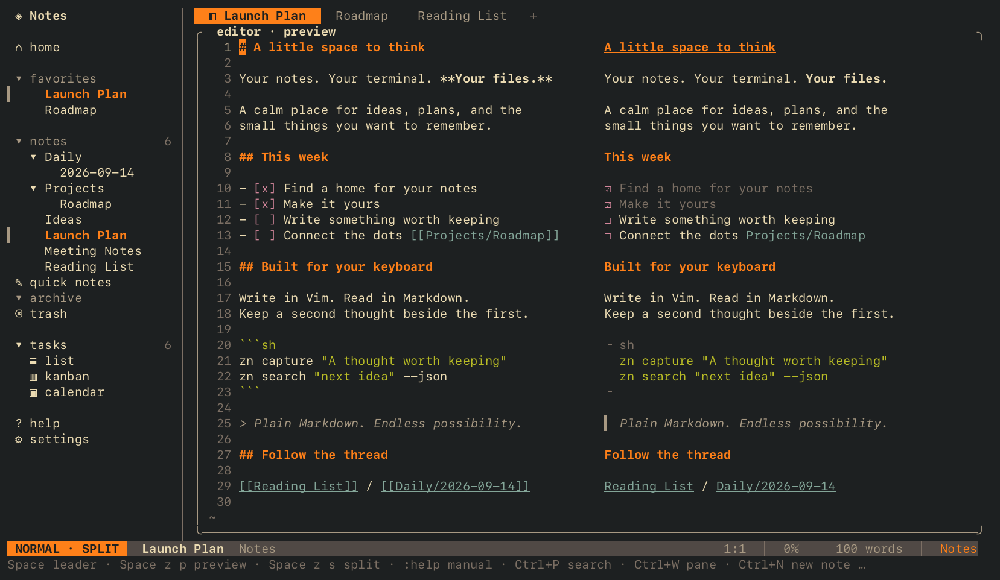

# zn

ZenNotes in the terminal: a scriptable CLI, a full terminal workspace, and
an MCP server in one Go binary. Write, organize, automate, and connect to
your self-hosted notes without leaving the terminal.

<p align="center">
  <a href="docs/media/zn-tui-workspace.png"></a>
</p>
<p align="center">
  <sub>Markdown editing and live preview, with your notes, tabs, and tasks close at hand. <a href="https://zennotes.org/tui#recording">Watch the demo.</a></sub>
</p>

Notes stay plain Markdown files in a folder you own. `zn` reads the same
vault, `config.toml` and `vault.json` as the ZenNotes desktop app, so both
can work on one vault, and a self-hosted ZenNotes server works as a remote
vault too.

**[Online manual](https://zennotes.org/tui/docs)** ·
[Install](#install) · [Quick start](#quick-start) · [Commands](#commands) ·
[Scripting](#scripting-and-shell-completion) ·
[Managed servers](#managed-servers) ·
[Updates](#updating-the-cli) ·
[Terminal app](#the-terminal-app) · [Configuration](#configuration) ·
[MCP](#mcp-server) · [Troubleshooting](#troubleshooting) ·
[Contributing](#contributing-and-sandbox)

> **New in v0.6.0:** Managed servers, installation-aware updates, status/doctor,
> settings commands, scoped help, shell completion, structured errors, shared
> cross-note yank registers, and copyable version reports. Upgrading from
> **v0.5.0 or earlier?** Use Homebrew, Go, or a fresh release download once:
> those versions do not yet have `zn update`. Desktop-managed installations get
> the version bundled with a desktop app update.

## What you get

- **The command line.** Every command of the desktop app's bundled `zn`
  (notes, search, folders, tags, tasks, comments, databases, capture,
  `open`, the MCP server), with the same names, flags, JSON shapes and task
  ids, so scripts written for one work with the other.
- **`zn tui`, the app.** Sidebar, tabs, splits, a reading view, Tasks as a
  list, Kanban board or calendar, Tags, databases with table and board
  views, templates, daily notes, a command palette, and a Vim engine at the
  core of everything. Prefer a plain editor? Turn Vim off. Files, comments,
  bulk actions, editable settings, themes, and per-vault sessions are included.
- **`zn mcp`.** The same tools the desktop's MCP server offers, for Claude
  Code, Codex and any MCP client.
- **Local and self-hosted workspaces.** Keep several vaults and server
  connections, switch between them, and use the same note commands against
  either backend. Remote changes arrive over the live feed with polling fallback.
- **Managed servers.** Install verified native server releases,
  configure a vault, start a login service, inspect logs, update, and roll back.
  CLI and TUI controls share the same implementation.
- **Automation tools.** Command-specific help, validated
  arguments, JSON errors, noninteractive mode, four shell completions,
  configuration get/set, workspace status, and diagnostics.

Local notes work offline and need no account. The CLI/TUI does not connect
directly to ZenNotes Cloud; use a local vault or a self-hosted ZenNotes server.
[The app documentation](https://zennotes.org/docs#apps-and-cloud) explains the
different connection and sync options.

## Install

`zn` is a single static binary with no runtime dependencies. Pick one:

**Homebrew (macOS and Linux).** Install from the same tap as the desktop app:

```bash
brew install zennotes/tap/zn
zn tui
```

Update with `brew update && brew upgrade zn`.

**Installed from the desktop app.** Desktop builds that include this terminal
runtime update their managed `zn` installation when the app opens. Keep using the
same command; `zn tui` opens the terminal app. Settings shows the installed version
and offers Repair when needed. Desktop never replaces a Homebrew or manual install.

Desktop-managed commands follow the desktop workspace even when the TUI remembers
a different one. Standalone installations keep their own default. Use
`--workspace-source app|terminal` or `ZENNOTES_WORKSPACE_SOURCE` to select the source
explicitly; `--vault` and `--server` still select a specific destination. The TUI
uses its own saved selection unless `--workspace-source app` is explicitly passed.
When the desktop app is on a ZenNotes server, desktop-managed commands and `zn mcp`
authenticate with the token `zn connect` saved for that server's URL: the app keeps
its own copy in the OS secret store, which zn cannot read.

If an older desktop build reports **Unknown command** for `zn tui`, check
`type -a zn`. A Homebrew installation can be run directly with
`"$(brew --prefix)/bin/zn" tui`. Update the installation that owns your command;
there is no need to overwrite one package manager's files with another installer.

**Download a release.** Grab the archive for your platform from the
[releases page](https://github.com/ZenNotes/tui/releases) (Linux, macOS and
Windows, amd64 and arm64), unpack it, and put `zn` somewhere on your PATH:

```bash
tar -xzf zn_*_linux_amd64.tar.gz
sudo install -m 755 zn /usr/local/bin/zn
```

**Use Go.** With Go 1.26 or newer installed (an older `go` from 1.21 on
fetches the right toolchain by itself):

```bash
go install github.com/ZenNotes/tui/cmd/zn@latest
```

`go install` prints nothing on success and puts the binary in
`$(go env GOPATH)/bin`, usually `~/go/bin`. That folder is often not on
PATH, so if `zn` is "not found" afterwards, add it:

```bash
export PATH="$PATH:$(go env GOPATH)/bin"
```

**Windows.** Extract the matching ZIP, open PowerShell in that folder, and run
`.\zn.exe tui`. Put `zn.exe` in a folder on your user Path to run `zn` anywhere.
`Get-Command zn -All` shows competing installations.

**Build from a checkout.** With Go 1.26 or newer, run:

```bash
go build -o zn ./cmd/zn
./zn --version
./zn tui
```

This builds exactly the code in your checkout. Use tag `v0.6.0` for this release
or the default branch for ongoing development. Build versions identify module
versions or checkout revisions unless a release version was explicitly stamped.

Either way, `zn --version` confirms the install. AUR packages are not
published yet.

Maintainers: [Homebrew packaging and release updates](packaging/homebrew/README.md).

Version 0.6.0 provides [installation-aware updates](#updating-the-cli).

## Quick start

To leave the TUI, press `Esc`, type `:qa`, and press `Enter`. This saves all
notes and quits ZenNotes. `:q` closes only the current tab (the last tab quits).

For a new vault:

```bash
zn init ~/Notes
zn create --title "First thought" --body "A little space to think."
zn tui
```

Already have notes? Run `zn vault add ~/Documents/notes`. Have a self-hosted
server? Run `zn connect https://notes.example.com --name home`; it asks for the
token once. Each command remembers its result and makes it the terminal default.
Use `--no-default` when adding a workspace you do not want to select immediately.

Inside the TUI, `Ctrl+P` finds a note, `i` enters Vim insert mode, `Esc` returns
to Normal mode, `Ctrl+S` saves, and `Ctrl+G` opens the command palette. `:settings`
lets you turn Vim off. `F2` exposes actions in either editing mode.

`zn setup` asks those questions interactively, and `zn tui` runs the same
wizard when nothing is configured yet. Bare `zn` opens the
TUI when stdin/stdout are terminals and prints help when piped. Later:

| Command | What it does |
| --- | --- |
| `zn vault list` | Every saved vault and server, the default starred. Entries marked `app` come from the desktop app and are managed there |
| `zn use <name>` | Set the terminal default (`zn use app` follows desktop again); desktop-managed scripts keep their own app default |
| `zn disconnect <name>` | Forget a server and its token |
| `zn vault remove <name\|url>` | Forget one of zn's own vaults or servers (a server's token too); note files stay |
| `zn vault mode root\|inbox` | Move a vault between the flat layout and the classic `inbox/` layout |

The list lives in `~/.config/zennotes/workspaces.toml`; server tokens go to
`credentials.toml` next to it, readable only by you. Scripts and CI can skip
the store with `--server <url>` and `ZENNOTES_REMOTE_TOKEN`. If either file
stops parsing, zn says so (`zn doctor`, `zn status`) and refuses to write over
it rather than replace it with an empty list.

## Commands

`zn --help` lists the commands; `zn <command> --help` shows scoped usage.
Data commands support `--json`. Raw-text commands such as `read`,
`completion` and `server logs` retain their text output unless documented otherwise.

Use `--no-input` and structured errors for automation; see
[scripting](#scripting-and-shell-completion) for exit codes and stream conventions.

| Area | Commands |
| --- | --- |
| Notes | `list` `read` `create` `write` `append` `prepend` `rename` `move` `archive` `unarchive` `trash` `restore` `duplicate` `delete` |
| Search | `search <query>` `search-title <q>` `backlinks <path>` |
| Folders | `folder list\|create\|rename\|delete` |
| Tags | `tag list\|find` |
| Tasks | `task list\|toggle` |
| Comments | `comment list\|add\|reply\|resolve`, threads on a note shared with the app and its MCP tools |
| Databases | `base list\|create\|rows\|get\|add\|set\|convert`, for `.base` folders and loose `.csv` files |
| Vaults | `setup` `init` `connect` `disconnect` `use` `vault info\|list\|mode\|add\|remove` |
| Other | `capture "..."` (quick note from an argument or stdin), `open <path>` (hand a note to the desktop app), `config` (open `config.toml` in `$EDITOR`), `read --pretty` (render a note in the terminal) |
| Managed servers | `server setup\|install\|list\|status\|start\|stop\|restart\|run\|logs\|config\|update` |
| Configuration | `config list\|get\|set\|edit`, `status`, `doctor`, `completion <shell>`, `update` |
| Runtimes | `mcp` (MCP stdio server), `tui [note]` (the terminal app) |

### Note and search examples

Paths are relative to the selected vault. `zn init` creates a root-layout vault;
existing vaults may use `inbox/`, so use the exact paths returned by `zn list`.

```bash
zn create --title "Project plan" --body "Start small." --tag work --tag ideas
zn read "Project plan.md"
zn append "Project plan.md" --body "Next action: send the draft."
zn read "Project plan.md" --pretty
zn search "draft" --limit 10 --json
zn list --tag work --json
zn backlinks "Project plan.md" --json
```

`write` replaces the whole body. `append` adds at the end; `prepend` inserts
after frontmatter. `trash` is reversible with `restore`; `delete --yes` is
permanent. `folder delete --yes` removes the folder and its contents.

### Tasks, comments, and databases

```bash
zn task list --unchecked --tag work --json
zn comment add "Project plan.md" "Can we simplify this?"
zn comment list "Project plan.md" --all --json
zn base create "Reading list"
zn base rows "Reading list" --json
```

Use the stable ID returned by `task list` with `task toggle <id>`. Comment
replies and resolve/reopen operations take a thread ID. `base add` and
`base set` accept repeated `--set Field=Value` flags for existing fields;
`base add --body` or `--page` also creates a record page. `base convert`
turns a loose CSV into a `.base` folder.

The [online command reference](https://zennotes.org/tui/docs#commands) lists
the command syntax and flags by area.

## Scripting and shell completion

### Pipes and JSON

```bash
printf 'A thought from the shell\n' | zn capture --tag ideas
printf '\nNext action: send it.\n' | zn append "Project plan.md" --body -
zn list --tag work --json | jq '.[].path'
zn read "Project plan.md" --json | jq '.body'
zn task list --unchecked --json
```

`jq` is optional and installed separately. `--body -` explicitly reads stdin;
`capture` reads stdin when no positional text is supplied. Quote paths and task
IDs containing spaces or shell-special characters. Successful JSON shapes stay
compatible with the desktop CLI.

### Predictable automation

```bash
zn --vault ~/Notes list --json --no-input
zn create --help
zn server update --help
```

Global flags work before or after commands. Repeated `--tag` and `--set` flags
retain their values; `--` ends flag parsing. Unknown flags, missing values,
and invalid argument counts fail before opening a vault. Help and global
version flags return without performing note operations.

| Result | Exit code / output |
| --- | --- |
| Success | `0`; command data on stdout |
| Operation failure | `1` |
| Usage/argument error | `2` |
| Cancellation | `130` |
| `--json` failure | Structured error on stderr |

```json
{"error":{"code":"usage","message":"unknown flag --titel. Did you mean \"title\"?"}}
```

Error codes in the envelope are `usage`, `error`, and `cancelled`. `--no-input`
prevents setup/token/editor prompts; provide the required arguments or environment
variables. Raw-text commands such as completion scripts and logs remain text.
`doctor --json` reports checks on stdout and returns a failure exit code when a
check fails. Package-manager update output goes to stderr.

### Completion

```bash
# Bash: source this file from your shell profile to keep completion enabled.
zn completion bash > ~/.zn-completion.bash
source ~/.zn-completion.bash
```

| Shell | Setup |
| --- | --- |
| Zsh | Initialize `compinit`, then source the output of `zn completion zsh` |
| Fish | Save `zn completion fish` to `~/.config/fish/completions/zn.fish` |
| PowerShell | Add the output of `zn completion powershell` to your profile |

Suggestions include commands, flags, saved vaults/connections, managed server
names, preference keys, and local note paths. Completion never contacts a
remote server.

## Managed servers

Install a native server **on the machine running `zn`**, backed by a vault you
choose:

```bash
zn server setup home --vault ~/Notes
zn server status home
zn list --server home
```

Setup downloads the official `ZenNotes/znserver` release, verifies its SHA-256
digest, generates a private token, installs a user service, and checks health,
authentication, version, and the exact served vault. It then saves a terminal
connection and selects it as the default. Repeating the same setup preserves
the installed version, token, and vault.

| Setup option | Purpose |
| --- | --- |
| `--bind 127.0.0.1:7879` | Use another address/port; the default is loopback `127.0.0.1:7878` |
| `--base-path /notes` | Serve under a URL prefix |
| `--version 2.56.0` | Choose a stable server release |
| `--no-default` | Keep the current terminal workspace selected |
| `--no-start` | Install without starting or registering a client connection |
| `--no-input --json` | Explicit, machine-readable setup for automation |

### Lifecycle and configuration

```bash
zn server list --json
zn server stop home
zn server start home
zn server restart home
zn server logs home
zn server config home --json
zn server config home --bind 127.0.0.1:7879
zn server config home --base-path /notes
```

- **macOS:** launchd user agent. **Linux:** systemd user service. Start enables
  the login service; stop disables it. Linux servers that must survive logout
  need user lingering configured separately.
- **Foreground:** `server install <name> --vault <folder>` installs only.
  Stop its background service, then `server run <name>` runs until Ctrl-C.
  Windows can use this mode where a native server release is available.
- **Settings:** `server config` accepts `--vault`, `--bind`, and `--base-path`.
  Changes are health-checked; failures restore the previous runtime settings.
  Changing the URL updates saved terminal profiles for the old URL.
- **Logs:** prints up to the last 64 KiB.
- **TUI:** `:servers` or **Manage local servers…** exposes setup, connections,
  status, lifecycle, logs, release checks, update/version selection, rollback,
  and listen-address changes. Long operations run in the background.

This first manager is local/native. It does not provision over SSH, manage
Docker containers, or install Windows background services. Existing remote or
Docker-hosted servers remain usable through `zn connect`.

### Server updates and rollback

```bash
zn server update home --check
zn server update home
zn server update home --version 2.56.0
zn server update home --rollback
```

`--check` does not modify the installation. Updates stage and verify a binary
before stopping the current service. The candidate must report the expected
version, authenticate its token, reject unauthenticated vault access, and serve
the configured vault. A failed upgrade restores the prior service; a successful
one retains the previous executable and digest for rollback.

The default chooses the latest stable release without downgrading. An explicit
version can select an older release. `--rollback` cannot be combined with
`--check` or `--version`. A stopped instance is briefly started for verification
and returned to stopped. Tokens and note files are preserved. Rollback restores
the executable/configuration, not vault-format migrations a server may perform.

### Runtime files

Managed instances live under the ZenNotes user-data directory’s `servers/<name>`
folder, or `$ZENNOTES_CONFIG_DIR/servers/<name>` when overridden:

```text
instance.json                         managed version, digest, and settings
server.json                           server runtime configuration
token                                 generated token (0600)
server.log                            service output
versions/<version>/zennotes-server     verified executables (.exe on Windows)
```

Runtime files and client credentials stay outside the vault. Lifecycle operations
use an instance lock; foreground execution holds it until exit. If a command is
forcibly terminated, first confirm no operation is running before removing its
specific `.lock`. `server restart` reapplies the saved manifest after interruption.
Automatic rollback covers ordinary failures and cancellation, not power-loss
recovery. See [the server guide](docs/managed-servers.md) for the full contract.

## Updating the CLI

```bash
zn update --check --json
zn update
zn update --version 0.6.0
```

The updater detects the owner of the executable being run:

| Installation | Update behavior |
| --- | --- |
| Homebrew | Runs `brew upgrade zn`; Homebrew selects its packaged version. Explicit version pinning is rejected. |
| Go-installed module | Runs `go install github.com/ZenNotes/tui/cmd/zn@v<version>` into the existing executable directory. |
| Desktop-managed | Directs you to update ZenNotes desktop, which owns the runtime. |
| Standalone macOS/Linux release | Verifies and extracts the release, probes version/protocol, retains `zn.previous`, then atomically replaces `zn`. |
| Windows standalone / other package managers | Provides the release or owner-specific update instruction. |

Native replacement needs a writable installation directory. Development builds
are rebuilt from source. `--check` reports availability without changing anything;
an explicit version can select an older release. Homebrew packaging may lag a
GitHub release, and a managed update verifies the resulting installed version.

Both downloaders use official repositories, size limits, and SHA-256 verification
through GitHub asset digests or an exact entry in the release checksum file.
Set `GH_TOKEN` for authenticated GitHub metadata requests if needed for rate limits.
The release downloader never uses the vault’s remote-server token.

## The terminal app

```bash
zn tui                          # the default vault
zn tui "Project Plan.md"        # open a note straight away
zn tui --vault ~/notes          # a directory
zn tui --server home            # a saved server
```

Every pane is a framed box with its tab strip above it: the active tab is a
filled block, `+` opens a new note, and the frame's top edge names what the
pane shows (`editor`, `preview`, `database`, `tasks`). `:zen` drops all the
chrome.

### Moving around

`Space` is the leader. The which-key panel appears immediately. Timed hints
expire after `vim.which_key_hint_timeout_ms`; `vim.which_key_hint_mode = "sticky"`
keeps them open until you choose an action, press Space again, or cancel.

| Keys | What |
| --- | --- |
| `Ctrl+P` | Search notes (Enter creates the note when nothing matches) |
| `Ctrl+N` | New note in the current folder |
| `Ctrl+S` | Save now (notes autosave a moment after you stop typing) |
| `Ctrl+B` | Toggle the sidebar |
| `Ctrl+W` then `v` `s` `h` `j` `k` `l` `q` `o` `=` | Split, move between and close panes |
| `Ctrl+O` `Ctrl+I` | Jump back and forward across notes |
| `gt` `gT` `]b` `[b` | Next and previous tab |
| `:` | Ex commands; `Space ;` or `Ctrl+G` opens the command palette |
| `?` | The keys of the current view; `:help` is the full manual |
| `F2` | Context actions, including when Vim mode is off |

The `Alt` chords (`Alt+1`…`Alt+9` for tabs, `Alt+E/S/P` for editor, split
and preview, `Alt+.` for zen) work where the terminal sends Option as Alt
(Ghostty: `macos-option-as-alt = true`). Everything they do has a leader or
`Ctrl+W` route as well.

### Leader map

| `Space` + | Opens |
| --- | --- |
| `o` `f` `s t` | Open buffers, search notes, search vault text |
| `e` `p` `c` | Toggle the sidebar, the outline panel, the calendar panel |
| `x` `k` | Tasks, the Kanban board |
| `d` `w` `m` | Today's daily note, this week's, this month's |
| `n` `q` `t` `i` | New note, quick capture, new note from a template, insert a template |
| `v` | Switch vault or server |
| `z p/s/e/v` `z w/n/z/t` | View: preview, split, editor, toggle; word wrap, line numbers, zen, theme |
| `l f/y/s/r/m/d/a/c/o/e` | Note: format, copy, favorite, rename, move, trash, archive, copy link, open in the desktop app, edit in `$EDITOR` |
| `h` `;` `?` | Hint mode, command palette, manual |

### Editing

The editor is a full Vim: counts, registers, marks, macros, dot-repeat,
undo and redo, text objects, visual, visual line and visual block, search,
`:s` `:g` `:sort` `:norm` with ranges, `gq`, and heading motions `]]` `[[`.
Markdown on top: `Ctrl+L` toggles the checkbox on the line, `gd` follows a
link, `gx` opens a URL, `gy` copies a link, `zc zo zM zR` fold headings,
Enter continues lists, Tab indents list items, `[[` opens the note picker
in insert mode, and fenced code is syntax-highlighted.

Yank/delete registers are shared across the TUI session.
Yank with `yy` or a visual selection, switch notes with `[b` / `]b` (or another
navigation method), then paste with `p` / `P`. Named registers such as `"a`,
linewise and blockwise selections, and delete history work across notes too.
Closing the source note does not discard its yank. Each note keeps its own
cursor and undo history; system-clipboard integration remains a separate preference.

Vim mode follows `[vim] enabled` in `config.toml`. With it off, the editor
is a plain editor. Use arrows and Enter in lists, F2 for context actions,
and Ctrl+G for the command palette. Ctrl+Z undoes plain-editor changes.

`Ctrl+Space` in insert mode (or `:complete`) completes tags, frontmatter
tag values, callouts and code-fence languages. With `markdown_snippets`
enabled, Space after an opening Markdown delimiter adds its closer;
Enter after a code fence creates its closing fence. `:table` adds/removes
rows or columns and sets alignment; `:formatting` opens formatting actions.
These edits participate in undo. `:format` still formats the whole note.
`vim.wrapped_line_motions = "display"` makes `$`, `I` and `A` use the
visible wrapped row; `"logical"` uses the source line.

`Space l e` opens the note in `$VISUAL` or `$EDITOR` at the cursor line and
reloads it afterwards. In Vim mode, `Ctrl+Z` suspends to the shell.

### Views

- **Tasks** has three layouts: list, Kanban board and calendar. Open one
  with `:tasks list|kanban|calendar`, `Space x`, `Space k`, or the rows
  under Tasks in the sidebar; `v` cycles them. `x` toggles, Enter opens the
  note at the line, `p d w c /` set priority, due date, waiting, cancelled
  and in progress, `f` filters, `m` opens the menu. The default board uses
  Today / Upcoming / In progress / Waiting / Done. `H`/`L` move a card;
  `g` regroups by status, priority, due date, folder or `field:<key>`.
  `:boardoptions` (also F2 → Board options) sets the folder root, column labels,
  custom statuses and card order. Folder boards keep cross-folder moves
  disabled. On the calendar Enter lists a day's tasks and `o` opens its
  daily note. Filters match the desktop's substring search over task text,
  note titles, `!priority`, `#tags` and `@fields`. `:filters` / `:savefilter`
  manage shared named queries. Prefix terminal operators with `where:`,
  for example `where: is:open due:today -meeting`.
- **Tags**: `Tab` multi-selects, `a` toggles any/all, `r`/`x` rename or
  remove a tag everywhere.
- **Databases**: every `.base` folder and every loose `.csv` file, with
  typed cells (text, number, checkbox, date, select, multi-select, note
  links), a header row for editing fields, saved filters and sorts, several
  table and board views, record pages, and a raw CSV toggle. `:dbconvert`
  turns a loose file into a folder.
- **Home** is a dashboard of today's note and tasks, recent notes, the week,
  favorites and tags. **Quick Notes**, **Archive** and **Trash** are lists
  with their own actions (`u` unarchive, `r` restore, `E` empty the trash).
- **Files** (`:files` / `:assets`): filter/sort attachments, inspect usage,
  attach a local file, copy/insert a link, open externally, rename with
  reference updates, trash and restore. Import limit: 64 MiB.
- **Templates** (`:templates`): preview, create, edit Markdown/metadata,
  duplicate, delete and override built-ins. The editor accepts the same
  frontmatter and template tokens as desktop.
- Side panels: Outline (`Space p`), Connections with backlinks
  (`:connections`), Calendar (`Space c`), Comments (`:comments`). Comments
  support anchors, replies, edit/delete, resolve/reopen and a scrollable
  full-thread reader through Enter → Read full thread.

In note lists and the sidebar, `Ctrl+Space` marks notes; `Shift+Up/Down`
extends the selection. Folder marks select their contained notes and
preserve subfolders when moved. `B` or `:bulk` opens the selection actions:
open, move, archive, trash, restore/unarchive. Marks survive filtering;
failed operations retain their marks and show an error report. Empty
folders continue to use the existing individual folder actions.

### Reading view, embeds and diagrams

`Space z p` shows the note rendered; `Esc` or `i` returns to the editor.
Rendering goes through Glamour, the renderer behind Glow; `preview_style`
under `[terminal]` picks a style (`auto`, Glamour's built-ins, a JSON style
sheet of your own, or `zen` for the built-in renderer).

- **Pictures** paint inline in Kitty and Ghostty through the Kitty graphics
  protocol (`[terminal] images = auto|kitty|off`); other terminals show a
  card. Inside tmux, set `allow-passthrough on`.
- **Files** (PDF, audio, video, drawings) and YouTube or Vimeo links are
  cards; Enter opens them.
- **`![[Note]]`** renders the note inline.
- **Mermaid** blocks draw as text through a pure-Go renderer, or as
  pictures when `mmdc` is installed. **`$$` math** renders through `typst`
  when it is installed.

### Vaults and servers inside the app

`:vault` (or `Space v`) lists every saved vault and server, with entries to
add a folder or connect to a server. `:server <url>` connects, asking for
the token once. Buffers are saved before a switch, each vault keeps its own
split layout, tabs, cursor/scroll positions and view state, and the vault
you switch to becomes the default for the next launch. The old flat session
format still restores. TUI layouts and card order have their own session file.

`:servers` is the separate **local server management**
menu. It can install, start/stop, inspect, update, and roll back an instance;
`:server` continues to select or connect to a remote workspace.

Search, interactive note opening and autosaves run in the background.
The status line reports loading, saving and conflicts. Remote servers use
the change feed, with 30-second polling and reconnect fallback. External
changes refresh clean buffers and preserve dirty ones. Use `:conflict` to
reload, keep local edits or save a copy. A close/switch reports a pending or
failed save; if shutdown cannot save edits, it reports a recovery JSON file
under the user-data directory's `tui-recovery/` folder.

Conflict checks compare the current content before saving. The existing
server API does not support atomic conditional writes, so simultaneous
writes between that check and the save still require coordination. Startup
restoration and explicit lifecycle operations can wait for I/O.

### Mouse and themes

The mouse works everywhere: click to focus and select, double click to
open, right click for the same menus `m` opens, wheel to scroll, drag to
select or to resize the sidebar and splits. `mouse = false` under
`[terminal]` turns it off.

`zn tui` draws with the color scheme the desktop app is set to. It reads
`theme_family`, `theme_mode` and `theme_id` under `[appearance]`, so every
built-in scheme works (Apple, Gruvbox, Catppuccin, GitHub, Solarized, One,
Nord, Tokyo Night, Kanagawa, Black Metal, Rosé Pine, each in its variants),
and so do the [custom themes](https://zennotes.org/docs#custom-themes) under
`~/.config/zennotes/themes/` and the accent and syntax colors set with Quick
tweaks. `theme_mode = "auto"` follows the terminal background. Colors a
terminal would draw too faint are nudged toward the text color until they
read; the rest of a palette is used as is.

`:theme` flips dark and light, `:theme nord` or `:theme catppuccin-mocha`
switches for the session, and `:themes` opens a picker that previews each
scheme. To give the terminal its own look, set `theme` under `[terminal]` to
a family, a variant or a custom theme's folder name; left empty, zn matches
the desktop app. [Themes](docs/themes.md) lists every variant and covers
custom themes in a terminal, the contrast rules and troubleshooting.

### Tag completion

Typing `#` and a letter in insert mode offers the vault's existing tags in a
menu under the cursor, as the desktop editor does: tags that start with what
you typed first, then tags that contain it, most used first. `Ctrl+N` /
`Ctrl+P` or the arrows move, `Enter`, `Tab` or `Ctrl+Y` accept, `Ctrl+E`
dismisses, and typing narrows the list. Inside a frontmatter `tags:` value
the same menu completes bare tags. `Ctrl+X Ctrl+O` opens it on demand, with
every tag when nothing is typed yet.

### What stays in the desktop app

Workflows, Atlas, sharing, cloud sync, Harper grammar checks and image
resizing. `Space l o` hands the current note to the app.

## Configuration

`~/.config/zennotes/config.toml` is shared with the desktop app; `zn config`
creates it with comments when it is missing. On Windows, it normally lives
under `%APPDATA%\zennotes`. `XDG_CONFIG_HOME` and `ZENNOTES_CONFIG_DIR` can
override the portable location.

`:settings` is searchable and editable. Supported user preferences persist
to `config.toml`; periodic-note and task-exclusion controls update the vault.
`:config` opens the file in an external editor, and `:reloadconfig` reloads
it immediately. External edits are otherwise picked up within a second.
`:bind` / `:unbind` persist, and `:keymaps` can edit bindings interactively.
Updates preserve unknown keys/tables and existing symlinks; TOML comments
and formatting are normalized when the file is written. Invalid supported
values produce an error while the running preferences remain active.

Periodic note paths and named date tokens follow each kind's configured
locale, including legacy patterns. The TUI keeps a horizontal tab strip
and a terminal folder tree; desktop `wrap_tabs` and `unified_sidebar`
layout choices do not change these terminal layouts.

| Section | Examples |
| --- | --- |
| `[vim]` | `enabled`, `which_key_hints`, `insert_escape` |
| `[editor]` | `line_number_mode`, `word_wrap`, `completed_task_style` |
| `[view]` | `tasks_view_mode`, `kanban_group_by`, `kanban_statuses`, `note_sort_order` |
| `[appearance]` | `theme_family`, `theme_mode`, `theme_id` |
| `[tweaks]` | `accent = "#ff3b30"`: the desktop's Quick tweaks colors |
| `[terminal]` | `mouse`, `preview_style`, `images`, `theme` (terminal only) |
| `[keymaps]` | `"action.id" = "keys"`, or `""` to unbind; `:keymaps` lists the ids |
| `[kanban_column_titles]` | `review = "In Review"` |
| `[saved_filters]` | `Important = "!high"` |

Per-vault settings (daily notes, favorites, folder layout) live in the
vault's `.zennotes/vault.json`, also shared with the app.

### Individual settings

```bash
zn config list --json
zn config get editor.word_wrap
zn config set editor.word_wrap false
zn config set editor.tab_size 2
zn config set terminal.theme nord
zn config edit
```

Use `section.key` names from `config list`. Boolean, integer, and string values
are validated through the same portable-preference implementation as the TUI.
Map sections such as `keymaps`, `saved_filters`, `kanban_column_titles`, and
`tweaks` are supported too. `config --path` prints the location and `config
--no-edit` creates the starter without opening an editor.

### How a vault is chosen

1. `--server <name|url>` (with `--token`, `ZENNOTES_REMOTE_TOKEN`, or the stored token).
2. `--vault <name|path>`: a saved vault, one the desktop app knows, or a directory.
3. `ZENNOTES_SERVER`, then `ZENNOTES_VAULT` in the environment.
4. In terminal-source mode, zn's own default, set by `zn use`, `zn connect`,
   `zn init`, or a TUI workspace switch.
5. The desktop workspace, as a fallback or directly in app-source mode.

The TUI defaults to terminal-source mode unless `--workspace-source app` is
explicitly passed. CLI commands use `--workspace-source`, then
`ZENNOTES_WORKSPACE_SOURCE`, then their default. Desktop's launcher sets the
environment source to `app`. The desktop runtime `zennotes.config.json` is
read-only to the CLI; terminal profiles and credentials have their own files.

`ZENNOTES_CONFIG_DIR` relocates every config file, which is what tests and
automation use.

### Environment reference

| Variable | Purpose |
| --- | --- |
| `ZENNOTES_VAULT` | Default local vault root |
| `ZENNOTES_SERVER` | Default server selector; precedes `ZENNOTES_VAULT` |
| `ZENNOTES_REMOTE_TOKEN` | Remote API token for scripts; explicit `--token` wins |
| `ZENNOTES_WORKSPACE_SOURCE` | CLI source: `app` or `terminal` |
| `ZENNOTES_CONFIG_DIR` | Override configuration, workspace, and credential locations; also isolates managed instances |
| `XDG_CONFIG_HOME` | Base directory for portable configuration when no explicit override is set |
| `ZENNOTES_APP_PATH` | Desktop application location for `zn open` |
| `VISUAL`, `EDITOR` | External editor for notes and configuration |
| `NO_COLOR` | Disable ANSI colors |
| `GH_TOKEN` | Authenticate official release metadata requests in the updaters |

Tokens for a remote server are selected from an explicit flag, then the
environment, then the applicable saved credentials. `zn connect` stores them
separately from workspace profiles. MCP clients can therefore use a saved
connection without embedding tokens in their own configuration.

## Troubleshooting

### Copy a TUI version report

Run `:version` (alias `:ve`) to open a persistent, scrollable report for a bug
report. It includes the TUI version, OS version/distribution, architecture, Go
runtime, embedded build revision, installation type, terminal information, and
workspace mode. When connected remotely, it also checks the server version and
shows its URL without URL credentials, query strings, or fragments. Local vault
paths and authentication tokens are omitted.

Press `c` or `y` to copy the report, or use `:version copy` / `:version!` to copy
when collection completes. Esc closes the report. Outside Vim mode, choose
**Version details / copy bug report info** from `Ctrl+G`, or press `v` in Settings.
An unreachable server is reported as unavailable; metadata collection runs in
the background and times out rather than blocking the editor.

### Start with status and doctor

```bash
zn status
zn status --json
zn doctor
zn doctor --json --no-input
```

`status` reports the executable, version, installation owner, platform, config
path, selected workspace, selection source, and whether credentials are
configured. Remote URLs are displayed without credentials, query, or fragment.
`doctor` checks supported configuration values, installation information,
configured editor, credential permissions, workspace access, and managed server
health. A failed check produces a nonzero exit code.

| Symptom | What to check |
| --- | --- |
| `zn` not found | Put the executable directory on PATH; Go normally installs into `$(go env GOPATH)/bin`. |
| Wrong version / unknown command | Run `zn --version` and `type -a zn` (PowerShell: `Get-Command zn -All`). A different installation may be first on PATH; preview commands require a build containing them. |
| Wrong vault opens | Use explicit `--vault` / `--server`; check environment variables and the app/terminal workspace source. |
| Remote authentication fails | Confirm the token matches the server. Run `zn connect <url>` to verify/store it; check `ZENNOTES_REMOTE_TOKEN` for an unintended override. |
| Cannot reach a LAN server on macOS | Check the URL, port, base path, running service, and Local Network permission for the terminal/app. |
| Live remote updates stop | Check WebSocket forwarding for `/api/watch` (under the configured base path); polling/reconnect is the fallback. |
| Note conflicts | Use `:conflict` to reload, keep local edits, or save a copy. Dirty buffers are preserved; see the read-before-write limitation above. |
| Save fails on exit | Follow the reported recovery JSON path under the user-data `tui-recovery/` directory. |
| Images appear as cards | Inline images need Kitty graphics support; inside tmux enable `allow-passthrough on`. |
| Alt/Option shortcuts do not work | Configure Option-as-Alt in your terminal, or use leader keys, Ctrl shortcuts, and the command palette. |
| Native update cannot replace the binary | Its directory must be writable. Use the owning installer for a managed installation; rebuild development versions from source. |
| Managed instance is locked | Wait for the running command or stop foreground execution; remove a stale `.lock` only after verifying no operation is active. |

## MCP server

`zn mcp` speaks MCP over stdio against the same vault resolution as every
other command. For Claude Code:

```bash
claude mcp add zennotes -- zn mcp
```

For other clients, register the command `zn` with the argument `mcp`:

```json
{ "mcpServers": { "zennotes": { "command": "zn", "args": ["mcp"] } } }
```

The tools match the desktop's MCP server one for one: notes, folders,
search, tasks, assets, comments, archive and trash.

The vault is resolved again before every tool call, so the server follows
the desktop app (or `zn use`) the way a fresh `zn` does. A switch never
redirects work silently: once the vault changes, every tool call stops with a
message naming the old and the new vault until the assistant calls
`vault_info`, which confirms the switch, and the calls after it run in the
new vault. Nothing an assistant planned in one vault lands in the other.

A vault on a ZenNotes server that needs a token gets it the way every
command does: `--token`, then `ZENNOTES_REMOTE_TOKEN`, then the token
`zn connect` saved for the server's URL. The desktop app keeps its copy in
the OS secret store, which zn cannot read, so run this once and the MCP
server authenticates whenever the app is connected to that server, with no
token in any client config:

```bash
zn connect https://notes.example.com --no-default
```

`--no-default` saves the token without making the server zn's own default,
so zn keeps following the app.

## Layout of the code

```
cmd/zn                   entry point
internal/cli             argument parsing, every zn command, help text
internal/tui             the terminal app (Bubble Tea)
internal/vim             the Vim engine, host-agnostic
internal/vault           vault semantics: layout, parsing, tasks, comments, edits, templates
internal/backend         local and remote backends behind one interface
internal/remote          HTTP client for the ZenNotes server
internal/releases        official release lookup, bounded downloads, SHA-256 verification
internal/server          native managed instances, health, lifecycle, updates, rollback
internal/selfupdate      installation ownership and verified native CLI replacement
internal/database        databases: .base folders and loose .csv files
internal/mcp             the MCP stdio server
internal/config          config.toml, workspaces, the desktop's app config
internal/keymaps         the bindable-action catalog and overrides
internal/periodic        daily, weekly and monthly note patterns
internal/templates       built-in and custom templates
internal/search          note search scoring
```

`go test ./...` runs the suite. The command tables, task grammar, database
files and comment sidecars are checked against the desktop app's
implementation, so the two stay interchangeable.

## Contributing and sandbox

The contributor sandbox builds your checkout and creates sample
notes, tasks, and isolated settings in a temporary directory:

```bash
bash scripts/sandbox.sh                   # interactive TUI
bash scripts/sandbox.sh --smoke           # local command smoke checks
bash scripts/sandbox.sh --server          # TUI against a real temporary server
bash scripts/sandbox.sh --server --smoke   # automated remote checks
```

Exit with `:qa`. The sandbox removes its files afterward. Server mode downloads
a verified release and runs it in the foreground without installing a login
service. It defaults to `127.0.0.1:17878`; set `ZN_SANDBOX_BIND` to another free
loopback address/port if needed.

Run the standard checks for code changes:

```bash
go test -race ./...
go vet ./...
go build ./cmd/zn
git diff --check
```

Tests cover desktop contracts, local/remote operations, download integrity,
interrupted staging, failed-update rollback, authentication, vault identity,
installation ownership, and CLI/TUI behavior. Actual service-manager validation
uses disposable instances on the corresponding OS. Use a copied executable for
self-update tests. [CONTRIBUTING.md](CONTRIBUTING.md) has the contributor workflow;
[managed-servers.md](docs/managed-servers.md) documents the runtime/update contract.

## License

MIT

## Compatibility development

See [shared contract fixtures](docs/shared-contracts.md) for the task-format and
self-hosted HTTP boundary checks, including optional tests against a real server.

### Desktop migration and creation dates

Desktop-managed commands keep following the desktop vault, while `zn tui` keeps
its own terminal selection. Atomic note saves preserve creation dates in portable
metadata without changing Markdown. See [Desktop CLI compatibility](docs/desktop-integration.md)
for the metadata format, client compatibility and rollback behavior.
